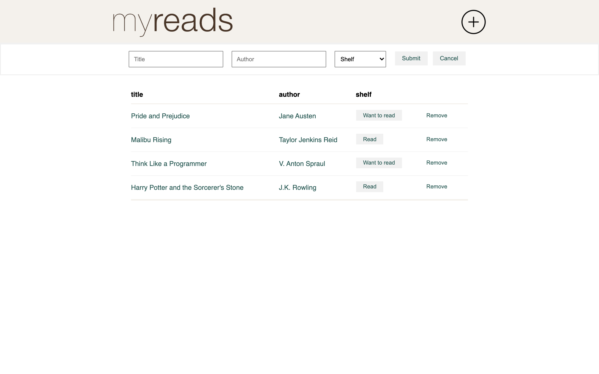

# 📚Library

[Live demo](https://kwen0.github.io/library-app/)

A simple personal library app. Users can add books, change their read status, and remove them.

## Tools Used
- Plain Javascript
- HTML
- CSS

## Reflections
Creating this solidified my knowledge of:
- object constructors
- iterating over arrays
- DOM manipulation
- how to create a table using Javascript
- CSS styling
